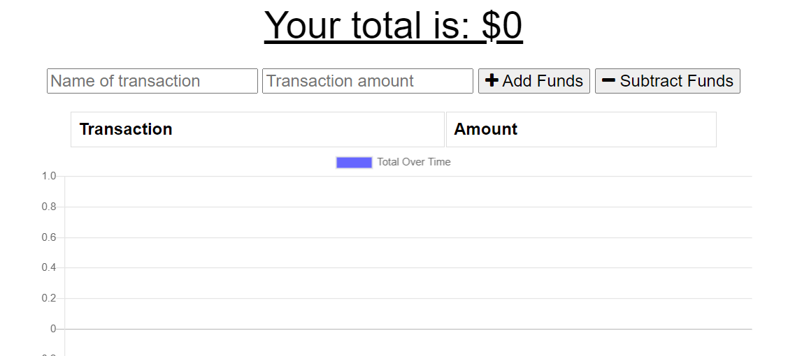
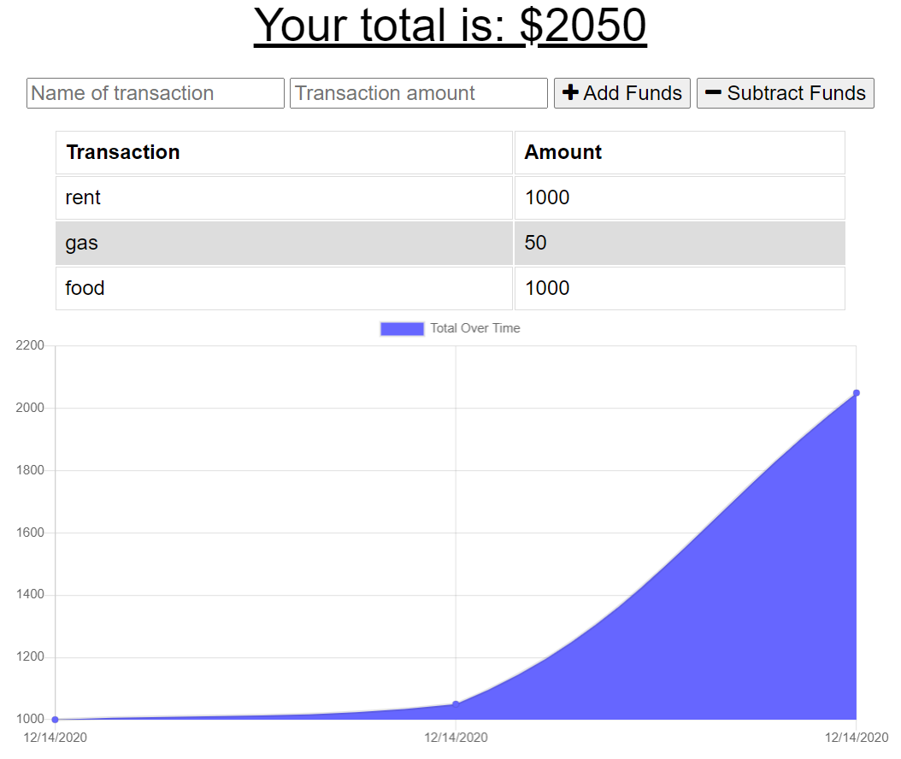

# Budget-Tracker 9000

[Link to working application](https://budget-tracker9000.herokuapp.com/)

## Description 

A budget app which the user can use to keep track of their deposists and expenses with or without the use of wifi

## Table of Contents

* [Installation](#installation)
* [Usage](#usage)
* [License](#license)
* [Contributing](#contributing)
* [Tests](#tests)
* [Questions](#questions)

## Installation

The app can be used through your browser or installed onto your desktop as a progressive web app.

[Click here to learn how you can download this as a PWA](https://support.google.com/chrome/answer/9658361?co=GENIE.Platform%3DDesktop&hl=en)

## Usage 

When the user fist opens the app they can enter the type of transaction they would like to add or subtract using the form located at the top of the app. 

The transactions will then be displayed in a convenient graph to show the transactions you've made over time.

When the user goes offline, any transactions added to the application will update when they come back online.

## License

  For more information on the license used, please click on the link below:

-  

## Contributing

The wonderful staff of the UCSD Extension Coding bootcamp provided the teaching and resources necessary to bring this app together.

## Tests 

NONE

## Questions

  For questions concerning my apps, click on the link below for my github:

  [Github Link] (https://github.com/jepoy92)

  Or click the link below for my email:

  [Email] (jeffrey1choi@gmail.com)
